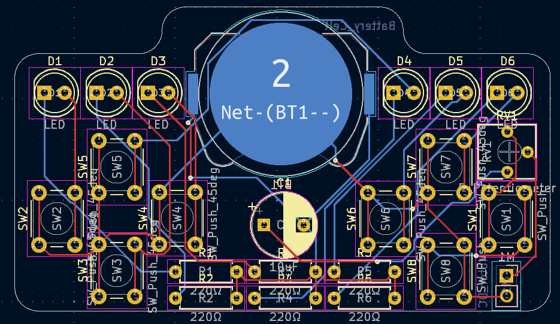
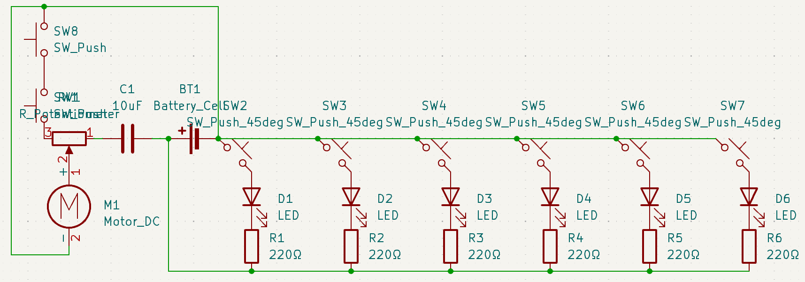
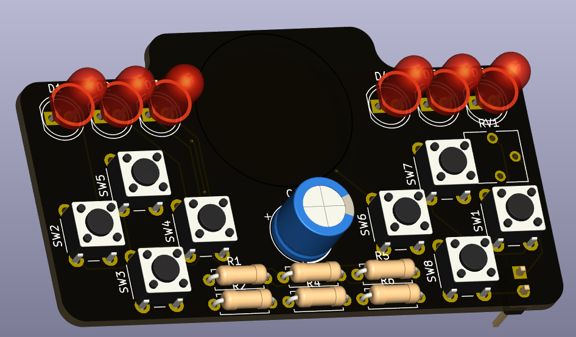

# haptic-hands
> A PCB fidget toy with haptic feedback for ultimate satisfaction. Good to help you relax, or somewhere to put your hands in an awkward social encounter.

Want a better viewing experience? [Read it here instead.](https://isobel-p.loves-being-a.dev/haptic-hands)

*(note to Journey voters: I forgot to upload my last update - oops... I finally arranged all the components and routed the PCB. I didn't get time to add silkscreen designs but I'm finally happy with how it turned out.)*

## Features
- Powered by one CR2032 battery. They're pretty cheap and most people should have some.
- 7x4cm (roughly) for a compact theraputic experience, fits in most pockets.
- The golden trio of satisfying sensations: pretty flashing lights, gentle vibration and the most satisfying buttons your fingers have ever touched.
- Designed for human hands so you won't get hand cramp from using it. You're welcome.
- Made with basic components so it won't break the bank.

## Components
|Component|Quantity|
|---------|--------|
|CR2032 Battery Cell|x1|
|6mm Push Button|x8|
|5mm LED|x6|
|Resistor|x6|
|Capacitor|x1|
|Potentiometer|x1|
|Mini Motor Disk|x1|

*The final schematic. My first attempt only had one button, but what fun would that be?!*

## Solder - 3D View
Download the STEP file in this repo or [check it out here.](https://autode.sk/4cU02na)

*Living in Flatland? Here's a screenshot.*

## The Journey
Ok kids, story time...

This was my first real PCB and wow was it hard. Looking at a blank KiCad schematic for the first time was scary. I kinda forgot to post updates somewhere in the middle, and I completely forgot to commit my changes so I just uploaded everything in massive chunks. I spent so many hours doing this that I really needed to spend revising for tests for the new school term.

But it was worth it.

Looking back after these ten days, I have something tangible, that I'll hopefully be able to hold in my human hands and use in my everyday life. This is something that I really needed, to keep me occupied in the quiet moments in everyday life, and I hope it's something you'll need too. Thank you to the people watching my journey, especially the nine of you who followed me in the end. It really helped, believe me. Thank you <3

## Contact Information
I'm @isobel-p on GitHub, HC Slack and most other socials.
